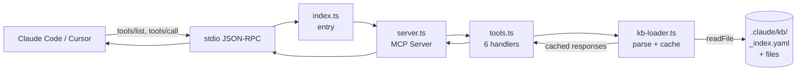

# MCP Server (`kb-mcp/`)

> Como o Knowledge Base do bravo-code-sdd-g é exposto a clientes LLM via Model Context Protocol.

---

## O que é

`kb-mcp/` é um servidor TypeScript que implementa o [Model Context Protocol](https://modelcontextprotocol.io). Ele lê `.claude/kb/_index.yaml` e expõe 6 tools que qualquer cliente compatível com MCP (Claude Code, Cursor, Windsurf, n8n) pode invocar para consultar o KB sem precisar de filesystem direto.

### Por que MCP em vez de só `Read`?

| Aspecto | `Read` direto | MCP via kb-mcp |
|---------|---------------|----------------|
| Discovery | Agent precisa saber paths exatos | Tool `kb_list_domains` enumera tudo |
| Search | Grep manual | Tool `kb_search` com ranking ponderado |
| Cache | Sem | Memória + invalidação por mtime |
| Sandbox | Filesystem total | Restrito a `KB_ROOT` (proteção `..` injection) |
| Cross-client | Específico do Claude Code | Funciona em Cursor/Windsurf/n8n também |
| Versioning | Sem | Estrutura via `_index.yaml` é contrato |

---

## Tools expostas

| Tool | Quando usar |
|------|-------------|
| `kb_list_domains` | Discovery inicial — não sabe o que está disponível |
| `kb_get_domain` | Já sabe o domínio, quer ver concepts/patterns disponíveis |
| `kb_search` | Não sabe nomes exatos, mas tem keywords |
| `kb_read_concept` | Já sabe domínio + nome do concept |
| `kb_read_pattern` | Já sabe domínio + nome do pattern |
| `kb_quick_reference` | Quer overview rápido de um domínio |

### Workflow típico de um agent

```text
1. kb_list_domains             → "tem 8 domínios: gcp, terraform, ..."
2. kb_search("cloud run auth") → "5 matches em gcp e terraform"
3. kb_read_concept(gcp, cloud-run) → conteúdo do concept
4. kb_read_pattern(gcp, oauth-token-validation) → conteúdo do pattern
```

---

## Instalação

```bash
cd kb-mcp
npm install
npm run build
```

Build gera `dist/index.js` executável. O comando `node dist/index.js` inicia o server em modo stdio (aguarda mensagens JSON-RPC em stdin).

### Configuração no Claude Code

`~/.claude/settings.json`:

```json
{
  "mcpServers": {
    "kb": {
      "command": "node",
      "args": ["/caminho/absoluto/kb-mcp/dist/index.js"],
      "env": {
        "KB_ROOT": "/caminho/absoluto/.claude/kb"
      }
    }
  }
}
```

Reinicie o Claude Code. Confirme com `/mcp` — deve listar `kb` com 6 tools.

### Configuração no Cursor

`.cursor/mcp.json` na raiz do projeto:

```json
{
  "mcpServers": {
    "kb": {
      "command": "node",
      "args": ["./kb-mcp/dist/index.js"],
      "env": { "KB_ROOT": "./.claude/kb" }
    }
  }
}
```

### Devcontainer (Codespaces)

`.devcontainer/post-create.sh` já roda `npm install && npm run build` automaticamente. Em Codespaces, o servidor está disponível imediatamente após o setup.

---

## Arquitetura



### Componentes

- **`src/index.ts`**: entry point, detecta `KB_ROOT` (env var, `../.claude/kb`, ou `./.claude/kb`), conecta `StdioServerTransport`
- **`src/server.ts`**: cria `Server` MCP, registra handlers `ListToolsRequestSchema` e `CallToolRequestSchema`
- **`src/tools.ts`**: 6 tool definitions com `inputSchema` (JSON Schema) e handlers que chamam o KBLoader
- **`src/kb-loader.ts`**:
  - `getIndex()` — parse YAML com cache invalidado por mtime
  - `search()` — keyword scoring (header matches valem 3pts, body 1pt, name match +5pts)
  - `readKBFile()` — sandboxed read (rejeita paths fora de KB_ROOT)

### Search ranking

```
score = sum(
  for each keyword:
    headerHits * 3 +
    bodyHits * 1 +
    (5 if keyword in itemName else 0)
)
```

Exemplo: query `"cloud run authentication"` em concept `cloud-run.md`:
- "cloud" no nome → +5 (1x)
- "cloud" em headers → +3 (2x) = +6
- "cloud" no body → +1 (5x) = +5
- "run" no nome → +5
- "authentication" em headers → +3
- Score total: ~24

---

## Diferença vs. `lint_agents.py` ou `validate_sdd.py`

| Componente | Linguagem | Modo | Quando |
|------------|-----------|------|--------|
| `kb-mcp/` | TypeScript | Server long-running (stdio) | Runtime do agent (cada query do LLM) |
| `validate_sdd.py` | Python | One-shot (CLI) | CI em PRs |
| `lint_agents.py` | Python | One-shot (CLI) | CI em PRs |
| `kb_drift.py` | Python | One-shot (CLI) | Cron semanal |

`kb-mcp` é a única peça que precisa estar rodando enquanto o agent trabalha. Os scripts Python rodam apenas em pontos discretos do CI.

---

## Performance

- **Cache de YAML**: parse só ocorre na primeira chamada ou após `_index.yaml` mudar (mtime check)
- **Cache de arquivos**: cada concept/pattern lido fica em memória até mtime mudar
- **Search**: linear em # de arquivos × tamanho médio. Para 8 domínios × ~20 arquivos × ~5KB = ~800KB scanned por search. Sub-100ms tipicamente.
- **Memory**: ~5-10MB residente

Para KB muito grande (>100 domínios), seria necessário trocar a search linear por um índice invertido (Lunr.js, MiniSearch). Não é o caso atual.

---

## Roadmap

- [ ] **MCP Resources**: cada concept/pattern como resource URI (`kb://gcp/concept/cloud-run`) — permite ao client linkar direto
- [ ] **MCP Prompts**: templates prontos como `prompt://kb/explain-domain`
- [ ] **Tool `kb_drift_status`**: expõe o resultado do `kb_drift.py` via MCP (alerta integrado no chat)
- [ ] **Publicação no npm**: `@regis-br/kb-mcp` para `npx` direto
- [ ] **Auth opcional**: para casos onde o KB tem material sensível (ex: spec contendo credentials de teste)

---

## Troubleshooting

### Cliente não vê o server

1. JSON do settings é válido? `jq . ~/.claude/settings.json`
2. `node` está no PATH onde o cliente roda? Em macOS, pode precisar de path absoluto: `/usr/local/bin/node` ou `/opt/homebrew/bin/node`
3. Logs do cliente: `~/.claude/logs/`

### "Could not detect KB root"

Defina `KB_ROOT` explicitamente:

```json
"env": { "KB_ROOT": "/abs/path/to/.claude/kb" }
```

### Tool retorna "Domain not found"

```bash
# Lista o que está no _index.yaml
yq eval '.domains | keys' .claude/kb/_index.yaml
```

Se o domínio que você espera não aparecer, ele não está registrado. Adicione em `_index.yaml`.

### Build falha com "Cannot find module @modelcontextprotocol/sdk"

```bash
cd kb-mcp
rm -rf node_modules package-lock.json
npm install
npm run build
```

### Performance ruim em search

Limite o escopo:

```javascript
kb_search({ query: "auth", domain: "gcp", type: "pattern", limit: 5 })
```

---

## Diagrama: vida de uma query

```text
[1] Agent precisa de info sobre Pub/Sub auth
[2] Agent invoca kb_search({ query: "pubsub authentication" })
[3] kb-mcp recebe via stdio
[4] kb-loader.search() varre concepts/patterns
[5] Score: gcp/concepts/pubsub.md → 18 pts
[6] Retorna ranked list com snippets
[7] Agent decide: kb_read_concept({ domain: "gcp", name: "pubsub" })
[8] kb-loader.readKBFile() lê do cache (já estava na memória da step 4)
[9] Retorna conteúdo completo
[10] Agent usa o conteúdo no DESIGN.md ou no código

Tempo total: < 200ms
Filesystem reads: 0 (cache hit)
```
