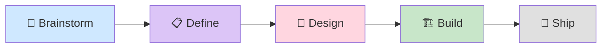

# bravo-code-sdd-g

> AI-Native Spec-Driven Development framework for Claude Code, com integração nativa ao GitHub.

[](https://github.com/Regis-BR/bravo-code-sdd-g)

---

## Visão geral

Este site documenta o **AgentSpec** (fork de `ip2cloud/bravo-code-sdd`) com integração nativa ao GitHub. O conteúdo é gerado automaticamente a partir do [repositório no GitHub](https://github.com/Regis-BR/bravo-code-sdd-g) via GitHub Actions + MkDocs Material.

### O que você encontra aqui

| Seção | Conteúdo |
|-------|----------|
| **Getting Started** | Setup, integração GitHub, roadmap das ondas |
| **Knowledge Base** | 8 domínios técnicos (GCP, Terraform, Gemini, etc.) |
| **SDD Framework** | Workflow 5-fases, agents, commands |

### Pipeline em 5 fases



Cada fase usa o modelo Claude apropriado: **Opus** para Brainstorm/Define/Design (raciocínio), **Sonnet** para Build (execução), **Haiku** para Ship (arquivamento).

---

## Quickstart

```bash
# 1. Use este repo como template no GitHub
# 2. Clone seu novo repo
git clone https://github.com/<seu-user>/<novo-repo>.git
cd <novo-repo>

# 3. Abra no Claude Code e inicie sua primeira feature
claude
> /define "Build Cloud Run function para extrair NF-e"
```

---

## Estado do projeto

Acompanhe o roadmap das 4 ondas de evolução em [Roadmap](ROADMAP.md):

- ✅ **Onda 1 — Fundação**: README, Issue Forms, PR template, labels, docs legais
- ✅ **Onda 2 — Integração GitHub**: CODEOWNERS, workflows de phase-sync, scripts de Project v2
- 🔄 **Onda 3 — Automação**: validate-sdd-artifacts, kb-drift-check, lint-agents, MkDocs Pages, telemetry
- 📋 **Onda 4 — Estrutural**: MCP server, bidirectional Issue↔.md, iterate-cascade, devcontainer

---

## Contato

- **GitHub**: [Regis-BR](https://github.com/Regis-BR)
- **Email**: regis@rnztech.com
- **Issues**: [Reportar bug ou sugerir feature](https://github.com/Regis-BR/bravo-code-sdd-g/issues/new/choose)
- **Discussions**: [Brainstorm e Q&A](https://github.com/Regis-BR/bravo-code-sdd-g/discussions)
